# Pin To-Do (Tauri)

A Windows desktop task widget: a card layer that lives on the desktop, and a task panel
that opens from it. The visual language is a 1971 terminal printout — paper, ink, index
marks, hard shadows.

This is the Tauri 2 rewrite of an Electron original. The reason for the rewrite was
resident memory and package size, and both improved by roughly an order of magnitude.

**Chinese version: [README.zh-CN.md](README.zh-CN.md)**

---

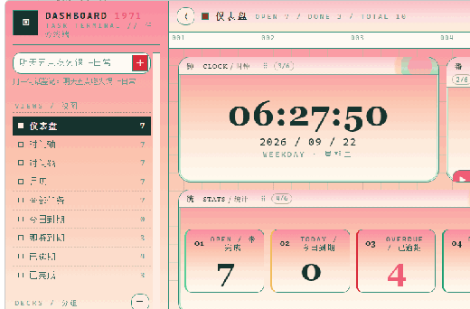

---

## What it does

**Card layer (`overlay.js`)** — a frameless, transparent, topmost window covering the work
area. Tasks live in a dock on one screen edge. Approaching the dock pops the deck into a
spread of cards; a card can be completed, timed, edited, dragged to a new spot, or pinned
so it stays on the desk when the deck is retracted or the group changes. The deck tucks
itself to the edge when idle.

**Task panel (`dashboard.js`)** — opened from the deck or the global hotkey
(<kbd>Ctrl</kbd>+<kbd>Alt</kbd>+<kbd>T</kbd>):

- **Dashboard** — a six-column grid the user assembles: clock, statistics, pomodoro dial,
  today ring, memo pad, year heat map and a short list. Drag a module's title bar to
  reorder it, drag its bottom-right grip to resize it; both snap to whole columns and
  whole rows and are saved.
- **Tracking axis** — a vertical 24-hour timeline with half-hour rules. Drag on empty
  space to schedule a work session, drag a block to move it, drag its lower edge to
  resize. Overlapping sessions split into lanes; a conic ring shows how the day was spent.
- **Timeline / calendar / ledger / views** — the same tasks as a day list, a month grid
  (double-click a day to file a task there), and a grouped ledger with search, priority
  filter and sort.
- **Quick add** — one line of Chinese or English natural language: `明天三点 开会 高`
  becomes a titled, scheduled, prioritised task.
- **Time report** — totals for today, the week or the month, the split by group, the last
  fourteen days as columns stacked in the order the day actually happened (earliest at the
  bottom, each band wearing its group's colour), and the five longest runs.
- **Daily receipt** — the same day printed as a thermal slip: completed count, tracked
  time, task names on or off, a stamp, a barcode and a torn edge. It feeds out of the slot
  in stuttering pulls with the motor running and a ding when it stops. The machine has a
  real control plate beside it — one column of round dome buttons, the two that hold a
  state (NAMES, TIMER) latched down with a pilot lamp beside them, and the hour set on a
  drum you scroll with the wheel and click for the system's fine editor. Every piece is
  drawn from the material's own tokens, so another material re-skins the hardware. Pressing
  PNG opens a share preview beside the machine — six backgrounds, including transparent —
  and the saved file is composited with the machine head above the paper, because
  `◆ PIN TO-DO 收银台` on the image is what tells anyone who sees it which software made it.
  A scheduled print shows only the machine and the paper, lands beside the desk with the
  panel closed, saves itself, and stays put until you pull the sheet off it — the body
  drags out of the way first if you need to. The hour, the switch and the save folder live
  in Settings → RECEIPT.
- **Pomodoro, memo, reminders, sound, tray, autostart**, and six materials, each with its own
  day and night palette: **印刷 1971** (the terminal sheet — square plates, hard print shadow,
  paper grain), **餐厅 DINER** (Googie console: enamel cream, chrome trim, rounded corners),
  **群青构成 IKB** (constructivist: flat, 2 px rules, International Klein Blue), **晨雾花园 GARDEN**
  (dawn light: a rose-to-cream ramp on every plate, acid-mint lattice, deep teal-black ink),
  **电蓝海报 POSTER** (screen print: electric blue doing the structure, acidic lime, hard-cut
  shapes, halftone dots, no shadows at all) and **指令台 RETRO** (mission console: bolted flange
  screws, bezel edge, scanline strips). Each is named for its visual language, not for a work.
  Labels take the material's typeface; every readout stays monospaced so the ledger columns
  line up. The colour lab overrides any token live and saves it per day/night.

Dates carry both solar and lunar labels (`9月20日 · 周日 · 农历八月初十`), and a task can
repeat on the lunar calendar year by year.

## The six materials

A material changes the surface, the outline, the corner radii, the typeface of the labels
and the day/night palette together — the card deck and the desk follow, not just the panel.

| 印刷 1971 · PRINT | 餐厅 DINER | 群青构成 IKB |
| --- | --- | --- |
| 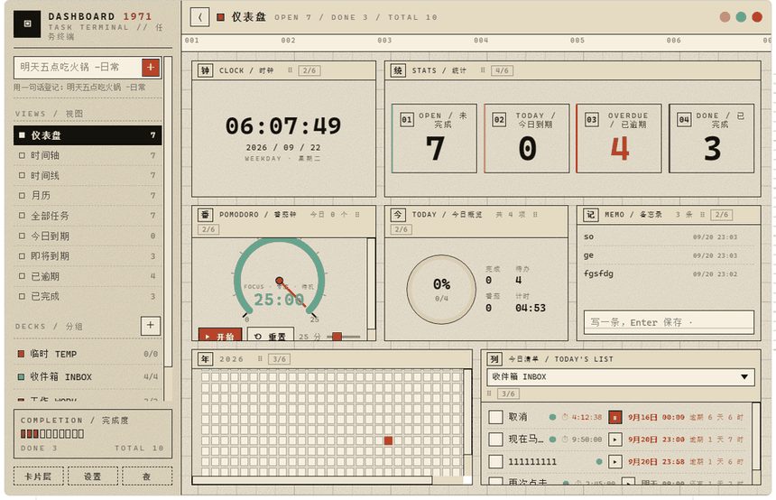 | 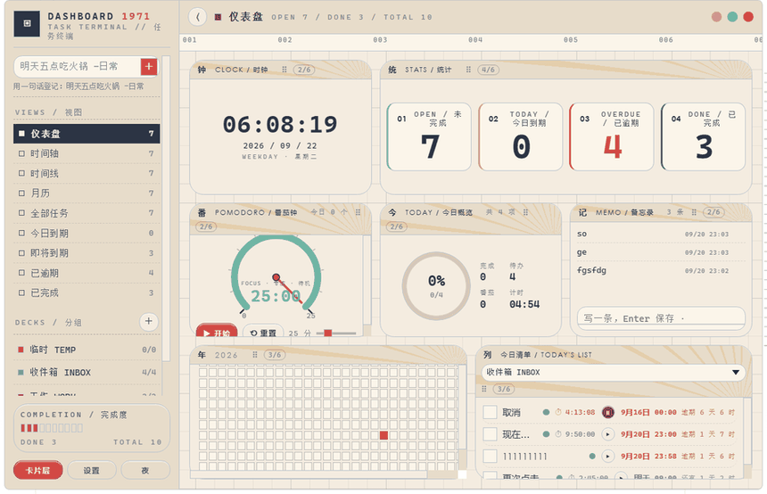 | 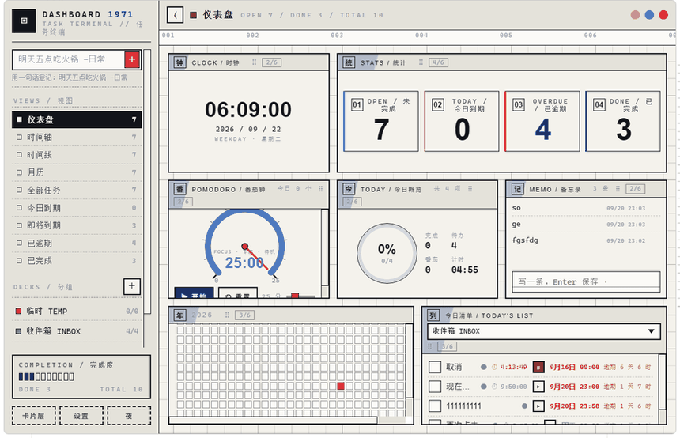 |
| **晨雾花园 GARDEN** | **电蓝海报 POSTER** | **指令台 RETRO** |
| 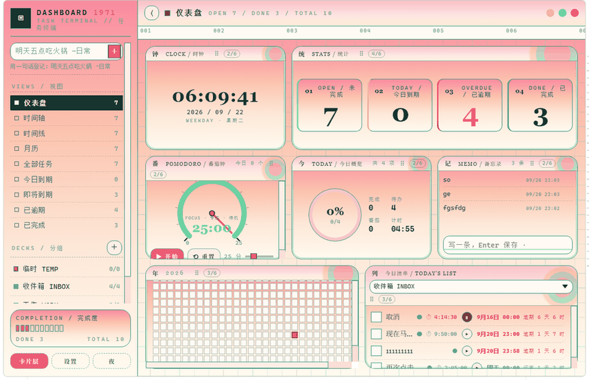 | 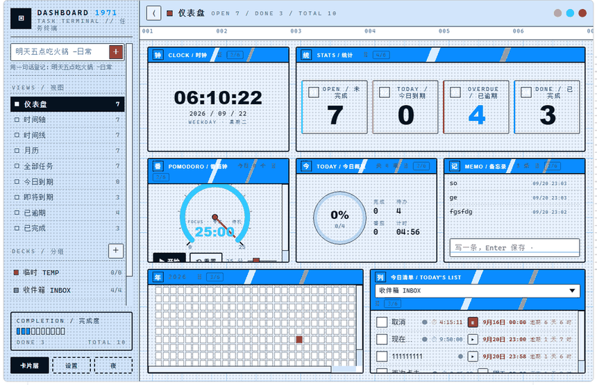 | 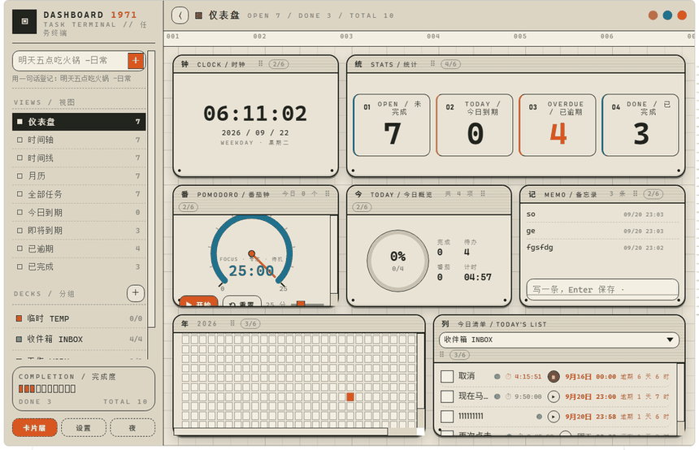 |

| 晨雾花园 · night | 电蓝海报 · night | 指令台 · night |
| --- | --- | --- |
| 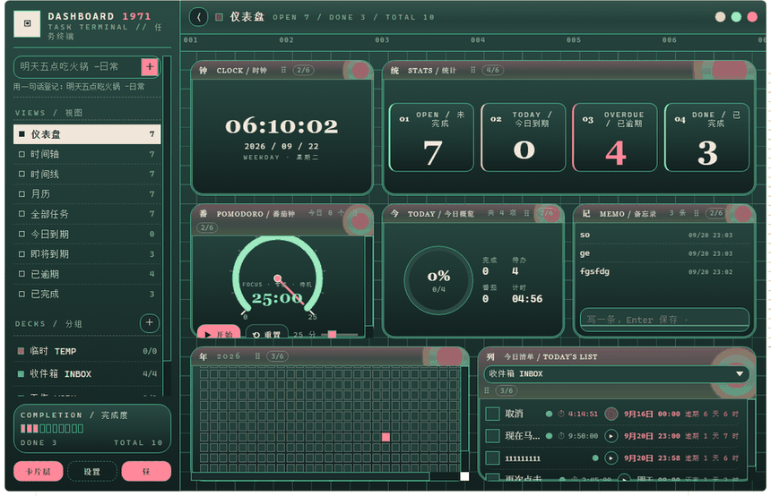 | 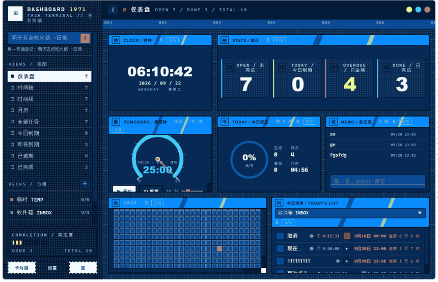 | 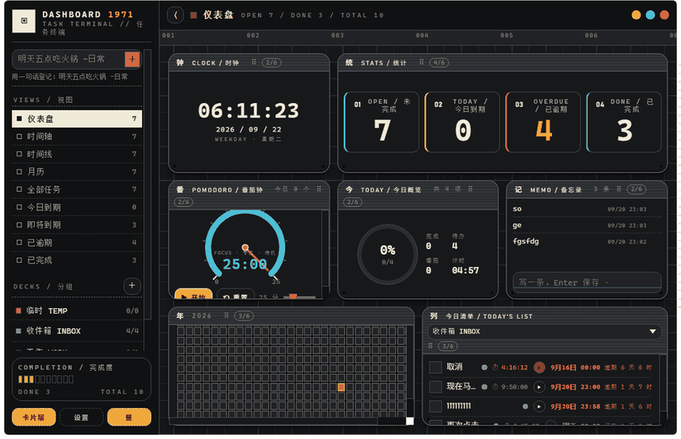 |

## Gestures

| Resize a dashboard module | Hover a ledger row |
| --- | --- |
| 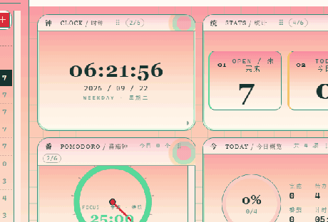 | 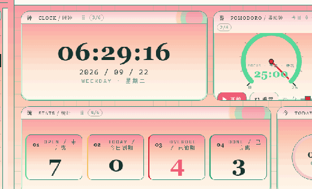 |

A module's title bar drags it to a new place in the grid; its bottom-right grip resizes it,
and both snap to whole columns and whole rows. In the ledger, hovering a row inverts it and
brings out the timer, editor, pin-to-desk and delete buttons beside the title.

## Numbers

Measured on the release build, x64, Windows 11:

| | |
| --- | --- |
| Installer | 1.63 MB (NSIS) |
| Executable | 4.95 MB |
| Resident card layer | ~116 MB private working set, one process |
| Rust | ~1,160 lines |
| Renderer | ~12,700 lines of JS, CSS and HTML |

The Electron original needed a Chromium runtime, several processes and roughly ten times
the memory. `--disable-gpu` alone halved its footprint, which is the measure of how much
of it was compositor overhead rather than the app.

## Architecture

Two windows, one process, WebView2 as the engine.

| Window | Label | Role |
| --- | --- | --- |
| Card layer | `main` | frameless, transparent, topmost, tool window, covers the work area |
| Task panel | `dashboard` | created on demand, remembers its geometry within the session |

**The reducer lives in the renderer** (`src/shared/data.js`), not in Rust. Both windows
apply the same operations to the same state and the host persists it. This kept the port
small: the Rust side is window management, the tray, the hotkey and a handful of Win32
calls — no domain logic duplicated across the boundary.

**Hit testing is done with a window region, not `WS_EX_TRANSPARENT`.** `SetWindowRgn`
clips *drawing* as well as input, so everything outside the cards falls through to the
desktop with no toggling race. Tilted cards cannot be expressed as rect unions, so each
card's four corners are reconstructed from its own transform matrix and staircased into
4 px scanline spans — 17 to 24 rectangles at rest. Pads differ by state: 8 px at rest,
90 px while a transition is in flight, plus an allowance for the card the browser reports
as hovered.

**Only five Win32 areas are reached by hand** (`src-tauri/src/win32.rs`, declared
`extern "system"` rather than through the `windows` crate): the cursor feed, the region,
window styles, monitor geometry and the foreground window. The layer has to be pinned to
`WS_POPUP | WS_EX_TOOLWINDOW` after creation *and kept there*: `decorations(false)` +
`skip_taskbar(true)` leave `WS_CAPTION` and `WS_EX_APPWINDOW` on the handle, something puts
them back about a second later, and the result is a taskbar button for a desktop ornament
plus a native blue caption whenever the window region is cleared. The foreground poll
repairs it and logs the transition.

The material is a second axis on the same token set: `data-style` picks the sheet or the
console, `data-theme` still picks day or night, and the colour lab keeps saving per theme.

**Visibility policy** lives in the renderer: the user's switch wins, then a fullscreen
rule (a film or a game owns the screen, so the deck steps out), then the optional
desktop-only rule. A foreground window on another monitor does not count as covering the
desktop.

## Building

Requirements on Windows:

- Rust (stable) with the MSVC toolchain and Visual Studio Build Tools
- Node 18+
- WebView2 runtime (preinstalled on Windows 11)

```bash
npm install
npm run build      # release bundle + NSIS installer
npm run dev        # watch mode
```

The installer lands in `src-tauri/target/release/bundle/nsis/`.

`tauri build` shells out to `cargo`, so `~/.cargo/bin` has to be on `PATH` — in Git Bash
that means exporting it in the same command line, since each shell starts fresh.

## Data

`%APPDATA%\dev.qoder.pintauri\dashboard1971-data.json` — tasks, groups, work sessions,
placements and settings, written on every change. The boot log used by the test harness
sits beside it as `boot.log`.

## Testing

There is no browser to attach to, so the app carries its own instrumentation: a test
script is injected into a window at boot and reports through `API.bootNote` into
`boot.log`.

```bash
pin-tauri.exe --monitor 2 --panel \
  --test-script tests/wake-distance.js \
  --test-script-panel tests/dash-assemble.js
```

`--test-script` targets the card layer, `--test-script-panel` the task panel, `--monitor`
aims every window this process creates at one display, and `--panel` opens the panel at
startup. `tests/` holds the assertions — geometry, region coverage, drag behaviour,
layout persistence. `tools/` holds the outside-in probes that measure what the page itself
cannot: window styles, pixels on the desktop, memory, and whether the deck survives a
fullscreen window.

The app is single-instance: a second launch signals the first and exits without reading
any flags, so stop the running instance before every test run.

Two of the probes are worth naming because they caught real bugs.
`tests/texture-continuity.js` compares every surface's resolved background against the
material's own `--tex-*` tokens, which is how a rule that squashed the texture into an
11×1 sliver, and a night rule that switched the garden ramp off the module plates, both
became visible. `tests/deck-texture.js` does the same in the other window and only
observes — two scripts driving the same shared setting overwrite each other, and every
report in both windows then describes whichever material happened to win.
`tools/ramp-scan.ps1` walks a column of the real screen and reports whether a gradient
restarts, because the DOM can claim `100% 100%` all day.
`tools/grab-frames.ps1` records a rectangle while driving the actual cursor, and
`tools/gif-encode.mjs` turns that dump into an animated GIF with median-cut palettes and
no third-party dependency — the screenshots and clips in this file came from that pair.

## Layout

```
src/                 renderer
  overlay.*          card layer: dock, spread, drag, pin, region
  dashboard.*        task panel: dashboard, axis, calendar, ledger, settings
  shared/data.js     the reducer, queries and persistence shape
  shared/nlp.js      quick-add parsing
  shared/lunar.js    lunar calendar and its repeats
  theme.css          every colour as a token
  theme-apply.js     the user's palette overrides
src-tauri/src/       host
  lib.rs             windows, tray, hotkey, cursor feed, region command
  win32.rs           the hand-declared Win32 entry points
  shell.rs           foreground window classification
tests/               injected assertion scripts
tools/               outside-in PowerShell probes
```
