# Pin To-Do

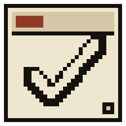

A Windows desktop task widget: a transparent card layer that lives on the desktop, and a task panel that opens from it. The visual language is a 1971 terminal printout — paper, ink, index marks, hard shadows.

This is the Tauri 2 rewrite of an Electron original, done for resident memory and package size; both came down by roughly an order of magnitude. Every pixel on screen is drawn by the app — one icon aside, there are no image assets, no canvas and no component library.

**中文：[README.zh-CN.md](README.zh-CN.md)**

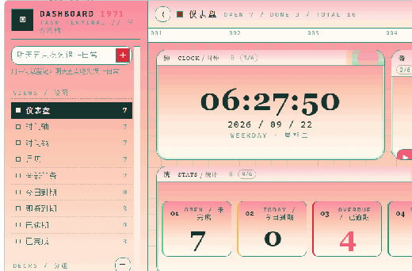

## What it does

**Card layer** — a frameless, transparent, topmost window covering the work area. Tasks sit in a dock on one screen edge; approaching it pops the deck into a spread of cards. A card can be completed, timed, edited, dragged to a new spot, or pinned so it stays on the desk after the deck retracts. The deck tucks itself away when idle.

**Task panel** — opened from the deck or the global hotkey (default <kbd>Ctrl</kbd>+<kbd>Alt</kbd>+<kbd>T</kbd>, editable in Settings):

| View | What it is for |
| --- | --- |
| Dashboard | a six-column grid you assemble: clock, statistics, pomodoro dial, today ring, memo pad, year heat map, short list. Drag a module's title bar to reorder, its bottom-right grip to resize; both snap to whole columns and rows and are saved |
| Tracking axis | a vertical 24-hour timeline with half-hour rules. Drag empty space to schedule a session, drag a block to move it, drag its lower edge to resize. Overlaps split into lanes; a conic ring shows how the day went |
| Timeline · calendar · ledger | the same tasks as a day list, a month grid (double-click a day to file a task there) and a grouped ledger with search, priority filter and sort |
| Time report | today / week / month totals, the split by group, fourteen days as columns stacked in the order the day actually happened, and the five longest runs |
| Daily receipt | the day printed as a thermal slip — feed-out with motor sound and a ding, a control plate of latched dome buttons and an hour drum, a share preview with six backgrounds, and a scheduled print that lands beside the desk and saves itself |

Dates carry both solar and lunar labels (`9月20日 · 周日 · 农历八月初十`), and a task can repeat on the lunar year.

**Ten materials**, each with its own day and night palette: 印刷 1971 (the terminal sheet), 餐厅 DINER (Googie enamel and chrome), 群青构成 IKB (constructivist, 2 px rules), 晨雾花园 GARDEN (a rose-to-cream ramp), 指令台 RETRO (mission console), 雾绿磨砂 FROST (frosted panes on a mint room), 图纸 BLUEPRINT (monochrome technical drawing), 紫电拼贴 COLLAGE (purple and cobalt, cut square), 黑黄战术 HI-VIS (hi-vis signage) and 铬黄丝网 CHROME (white paper, chrome-yellow slabs). Each is named for its visual language, not for a work. A material switches surface, outline, corner radii, label typeface and palette together — the deck and the desk follow, not just the panel — and the colour lab overrides any token live, saving per day/night.

| 印刷 1971 · PRINT | 餐厅 DINER | 群青构成 IKB |
| --- | --- | --- |
| 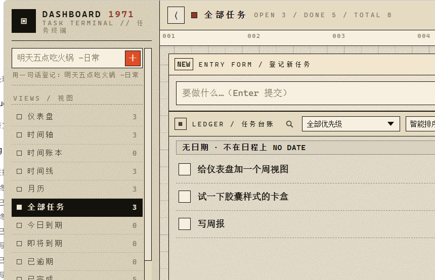 | 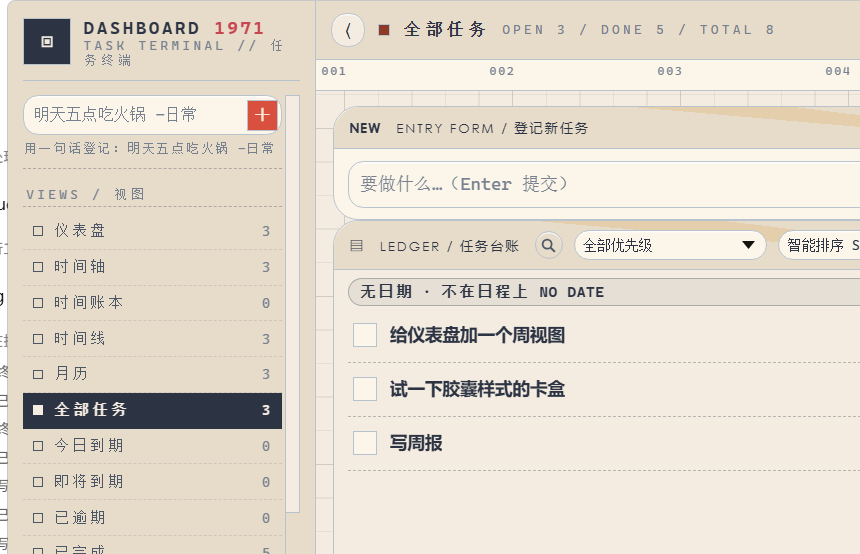 | 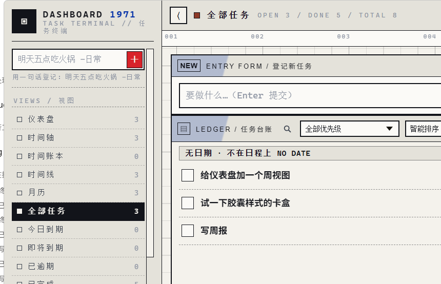 |
| **晨雾花园 GARDEN** | **雾绿磨砂 FROST** | **指令台 RETRO** |
| 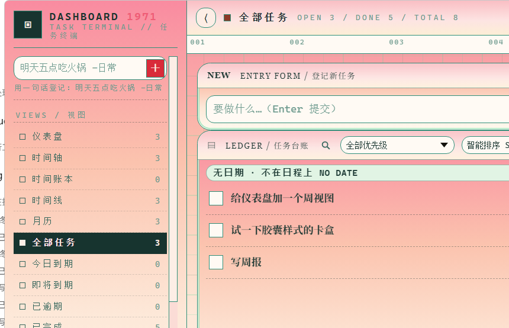 | 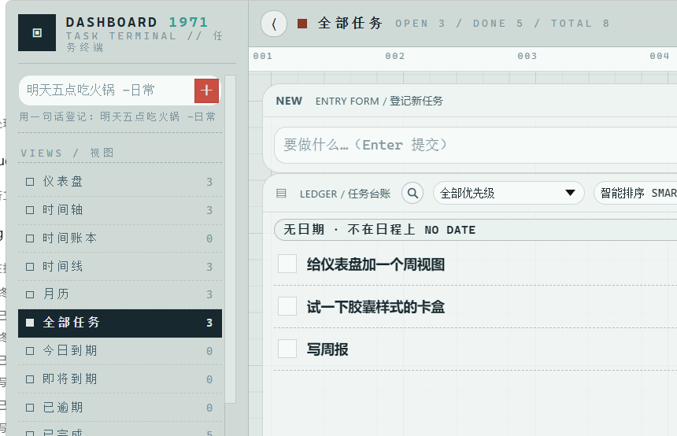 | 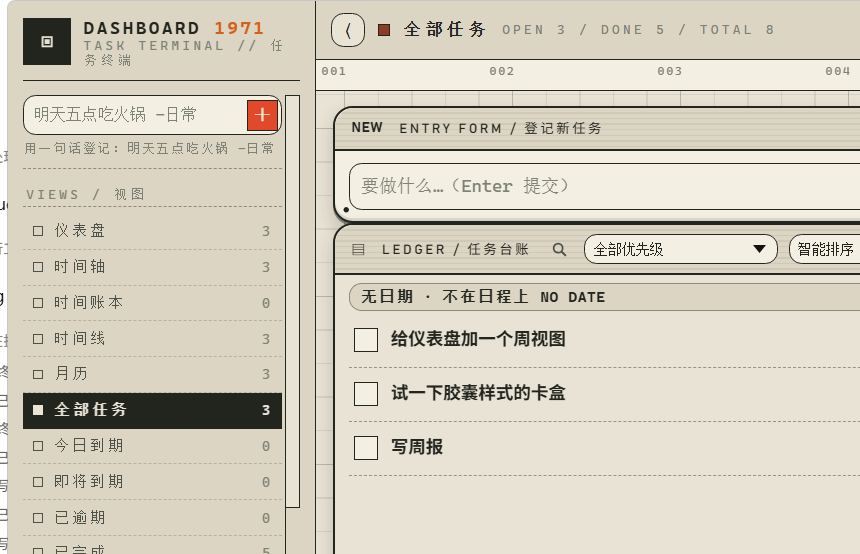 |
| 晨雾花园 · night | 雾绿磨砂 · night | 指令台 · night |
| 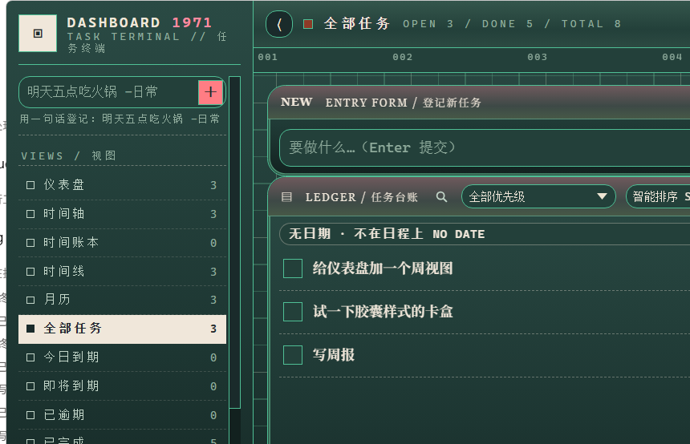 | 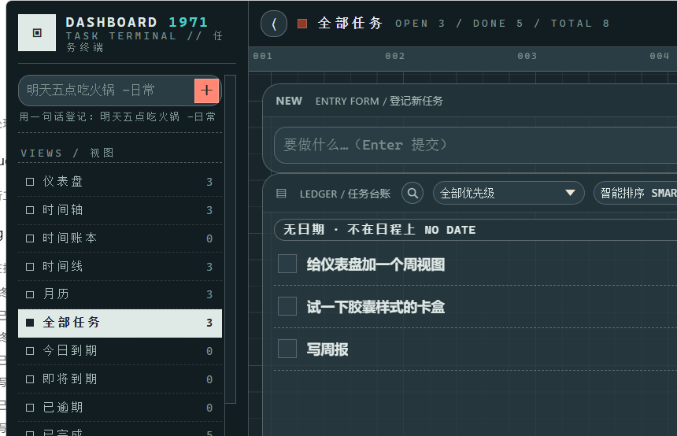 | 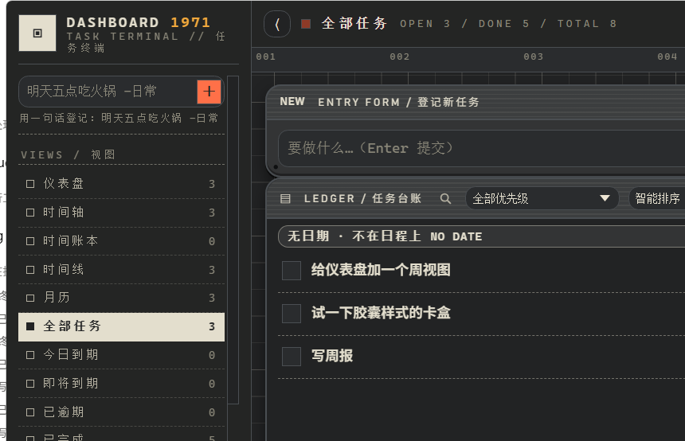 |

| Resize a dashboard module | Hover a ledger row |
| --- | --- |
| 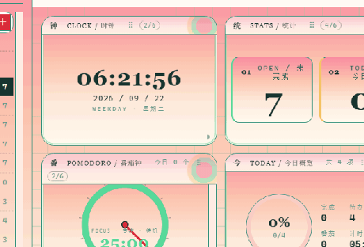 | 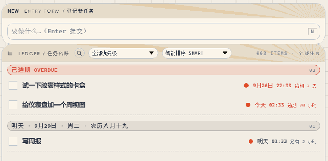 |

## Scheduling with an agent

Type one sentence — `明天面试推迟到后天` — and the assistant works out what you meant. The design constraint was that a wrong answer must never reach your data:

- **The model decides intent, not arithmetic.** Dates are parsed locally by `src/shared/nlp.js`; the model never computes a timestamp.
- **Three tools, no writes.** `suggest_tasks`, `suggest_changes`, `ask_user`. The model returns a *draft*; every row is editable, and nothing touches the store until you press 确认.
- **Provider dialects are normalised.** A call the model writes into `content` in its own markup is read back; a mis-picked tool is repaired deterministically when the sentence names exactly one task.
- **Refusals and loops are handled.** A change sentence that cannot be resolved is refused with a reason rather than answered with a new task; a question already asked is cut off instead of asked twice.
- **A write is not a write until the store says so.** After 确认, `commit` re-reads the state and compares it against what it asked for; an op that answers `ok` while changing nothing is reported as `verify-failed`, naming the title and the two times. This is not defensive theatre — `todo:update` once carried flat fields where the reducer reads `patch`, every op answered ok, and nothing moved.
- **The hostile cases are in the suite.** An unregistered tool, an id that is not in the store, a legal-shaped order to finish everything, a task title that is itself a prompt injection, empty and absurd input, one sentence with two asks — each asserted against the store afterwards, not against the model's own account of what it did.
- **It is observable, and it is on disk.** Every step — dialect read, repair, refusal, commit, verification — goes into a ring buffer shown in an in-app trace panel, and every turn is appended to `agent-trace.jsonl`. `node tools/replay.js 12` runs a recorded turn again and compares the two stage sequences.
- **It is optional and bounded.** Off by default; the key lives in the Windows credential manager and never in the state file; requests leave from Rust over WinHTTP, so there is no `fetch` in the page and no CORS surface.

### What it scores

`node tools/eval.js` — no key, no network beyond loopback, and the same command gates every push in CI.

| suite | what it pins | cases |
| --- | --- | --- |
| A · resolver | surface form → timestamp on a clock pinned to Thursday 2026-09-24, asserted to the day | 49 |
| B · loop | request → `tool_calls` → resolve, against the mock | 3 |
| C · write | the loop ending in the app's real reducer, read back afterwards | 17 |
| D · guard | hostile and absurd input, read back afterwards | 10 |

**79/79.** `--reps 3` runs the model-facing suites three times and prints only the disagreements — the only honest answer to "is it flaky?" when a model is in the loop. `--json <file>` appends each run (sha, per-suite pass counts, p50/p95, tokens, first-try rate) and prints the last five side by side, so "did the prompt change help?" is a table lookup rather than a memory. Without the mock running it reports suite A alone and says why.

### What an endpoint shape costs

Same suites, one knob on the mock (`MOCK_NO_TOOLS=dialect|prose`), because every real provider is one of these three:

| endpoint shape | A | B | C | D | total | first try |
| --- | --- | --- | --- | --- | --- | --- |
| native `tool_calls` | 49/49 | 3/3 | 17/17 | 10/10 | **79/79** | 12/18 |
| the call written into prose (Qwen behind the HF router) | 49/49 | 3/3 | 17/17 | 10/10 | **79/79** | 0/15 |
| no tool calling at all (a local compat endpoint) | 49/49 | 1/3 | 7/17 | 8/10 | 65/79 | 0/17 |

The middle row is what the dialect reader buys: the score does not move, the first-try rate goes to zero. The last row is the honest limit of the local fallback — creating tasks survives, because the app parses dates anyway; editing an existing one does not, because nothing can fall back to naming a record. That is an endpoint capability, not a prompt problem, and `node tools/provider-table.js` prints it.

### Five minutes, in order

```bash
node tools/mock-llm.js 8787          # a scripted provider, failure branches included
npx tauri build                      # or: npm run dev
```

1. Settings → AI 排程 → on, base `http://127.0.0.1:8787/v1`, model `mock`. No key involved.
2. On the deck, press ✨ and type `下周二下午我有三个人需要面试，帮我安排好时间`.
3. Three drafts arrive, staggered 14:00 / 15:00 / 16:00. The day came from the local parser — the model was asked to say 下周二 and nothing more.
4. Close it without pressing 确认. Nothing is in the store; the suite asserts exactly that (`只跑不确认 → 零写入`).
5. Type `把明天的面试推到后天` with two tasks named 面试 — it asks, or it picks by the date in the sentence; the trace shows which.
6. Open the trace panel and replay the turn: `node tools/replay.js <轮号>`.

## Numbers

Measured on the release build, x64, Windows 11:

| | |
| --- | --- |
| Installer | 1.66 MB (NSIS) |
| Executable | 4.90 MB |
| Resident card layer | ~116 MB private working set, one process |
| Host (Rust) | 3,671 lines across 6 files |
| Renderer | 16,688 lines of JS, CSS and HTML |
| Regression surface | 108 injected scripts, 48 outside-in probes |
| Agent eval | 79 cases in 4 suites, deterministic, gated in CI |

The Electron original needed a Chromium runtime, several processes and roughly ten times the memory. `--disable-gpu` alone halved its footprint, which is the measure of how much of it was compositor overhead rather than the app.

## How it is built

Two windows, one process, WebView2 as the engine.

| Window | Label | Role |
| --- | --- | --- |
| Card layer | `main` | frameless, transparent, topmost, tool window, covering the work area |
| Task panel | `dashboard` | created on demand, remembers its geometry within the session |

**The reducer lives in the renderer** (`src/shared/data.js`), not in Rust. Both windows apply the same operations to the same state and the host persists it, so the host stays what it was — windows, tray, hotkey, cursor feed, a few Win32 calls — with no domain logic duplicated across the boundary.

**Hit testing is a window region, not `WS_EX_TRANSPARENT`.** `SetWindowRgn` clips *drawing* as well as input, so everything outside the cards falls through to the desktop with no toggling race. Tilted cards cannot be expressed as rect unions, so each card's four corners are reconstructed from its own transform matrix and staircased into 4 px scanline spans — eight rectangles for six docked cards at rest. Pads differ by state: 8 px at rest, 90 px while a transition is in flight, plus an allowance for the card the browser reports as hovered.

**The caption a desktop widget must never show.** `decorations(false)` + `skip_taskbar(true)` still leave `WS_CAPTION` and `WS_EX_APPWINDOW` on the handle, and the toolkit rewrites its cached styles, so the layer is re-pinned to `WS_POPUP | WS_EX_TOOLWINDOW | WS_EX_LAYERED` by a window-event hook — a poll loses that race by a few hundred milliseconds every time. The remaining artifact was not a style write at all: DWM composes a caption into the layered window's own redirection surface **at the moment the window is activated**, and nothing removes it but reallocating that surface (a 1 px resize with a wait between the halves). So the layer carries `WS_EX_NOACTIVATE` and refuses activation entirely, except while a modal needs the keyboard, and hands the activation back to whoever had it when the modal closes. For the window of time a modal is up, the region gives up the top 34 px — the caption's only chance of being seen is a region that covers it — and only when nothing painted wants that strip.

**Hand-declared Win32, no crates.** `src-tauri/src/win32.rs` declares the entry points it needs as `extern "system"`: cursor, region, styles, monitor geometry, foreground classification, DWM attributes and a `SetWinEventHook`. `net.rs` speaks WinHTTP and `secrets.rs` the credential manager, on the same principle. That is most of what keeps the installer at 1.66 MB.

**Visibility policy** lives in the renderer: the user's switch wins, then a fullscreen rule, then the optional desktop-only rule. A foreground window on another monitor does not count as covering the desktop.

## Getting started

Requirements on Windows:

- Rust (stable) with the MSVC toolchain and Visual Studio Build Tools
- Node 18+
- The WebView2 runtime (preinstalled on Windows 11)

```bash
npm install
npm run dev        # watch mode
npm run build      # release bundle + NSIS installer
```

The installer lands in `src-tauri/target/release/bundle/nsis/`. `tauri build` shells out to `cargo`, so `~/.cargo/bin` has to be on `PATH` — in Git Bash that means exporting it in the same command line, since each shell starts fresh.

State lives in `%APPDATA%\dev.qoder.pintauri\dashboard1971-data.json` — tasks, groups, work sessions, placements and settings, written on every change. The boot log the test harness reads sits beside it as `boot.log`.

## Testing

There is no browser to attach to, so the app carries its own instrumentation: a script is injected into a window at boot and reports through `API.bootNote` into `boot.log`.

```bash
pin-tauri.exe --monitor 2 --panel \
  --test-script tests/wake-distance.js \
  --test-script-panel tests/dash-assemble.js
```

`--test-script` targets the card layer, `--test-script-panel` the task panel, `--monitor` aims every window this process creates at one display, `--panel` opens the panel at startup. The app is single-instance — a second launch signals the first and exits without reading any flags — so stop the running instance before every run.

`tests/` holds the assertions: geometry, region coverage, drag behaviour, layout persistence, contrast per material, and the agent's write path against the real reducer. `tools/` holds the outside-in probes for what a page cannot see about itself: window styles, pixels on the desktop, memory, whether the deck survives a fullscreen window.

A few earned their place:

- `tests/texture-continuity.js` compares every surface's *resolved* background against the material's own `--tex-*` tokens. Reading a token is not enough: `getComputedStyle(root).getPropertyValue('--x')` hands back the literal `color-mix(...)` text, which a naive parser turns into black.
- `tests/band-clip.js` asserts the region stops claiming the caption strip while a modal holds the keyboard, and that nothing painted was left outside the region.
- `tools/flashburst.ps1` records both screens and writes a frame only when the picture changes. Four rounds of reasoning about a "white box" ended when it caught one: a probe that asks a specific question reports *absent* for reasons that have nothing to do with the artifact.
- `tools/grab-frames.ps1` and `tools/gif-encode.mjs` produced every screenshot and clip in this file, with median-cut palettes and no third-party dependency.

## Layout

```
src/
  overlay.*          card layer: dock, spread, drag, pin, region, visibility policy
  dashboard.*        task panel: dashboard, axis, calendar, ledger, settings
  agent.js           the scheduling agent: tools, dialects, repair, drafts
  receipt.js         the thermal printer: feed, tear, control plate
  planfield.js       drag-to-schedule geometry on the tracking axis
  shared/data.js     the reducer, queries and the persistence shape
  shared/nlp.js      quick-add and date parsing
  shared/lunar.js    lunar calendar and its repeats
  theme.css          every colour, radius and texture as a token; one block per material
  theme-apply.js     the material and hour axes, plus the user's palette overrides
src-tauri/src/
  lib.rs             windows, tray, hotkey, cursor feed, region and AI commands
  win32.rs           hand-declared Win32 and DWM entry points
  net.rs             WinHTTP client
  secrets.rs         Windows credential manager
  shell.rs           foreground window classification
tests/               injected assertion scripts
tools/               outside-in probes and the eval harness
```
