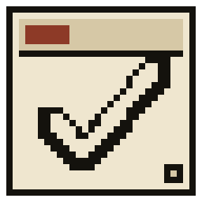

# Pin To-Do（Tauri 版）



一个 Windows 桌面任务组件：一层贴在桌面上的透明卡片层，以及从它打开的任务面板。视觉语言是 1971 年的终端打印件——纸、墨、索引号、硬阴影。

这是 Electron 原版的 Tauri 2 重写，动机是常驻内存和安装包体积，两项都降了大约一个数量级。屏幕上每一个像素都由应用自己画：除了一枚图标，没有图片资源、没有 canvas、没有组件库。

**English: [README.md](README.md)**


## 它能做什么

**卡片层**——一个无边框、透明、置顶、铺满工作区的窗口。任务住在贴屏幕边缘的卡盒里，鼠标靠近就把卡盒弹成一片卡片；卡片可以完成、计时、编辑、拖到别处，或者钉住——钉住的卡片在卡盒收回或切换分组后仍留在桌面上。闲置时卡盒自己缩回边缘。

**任务面板**——从卡盒或全局快捷键打开（默认 <kbd>Ctrl</kbd>+<kbd>Alt</kbd>+<kbd>T</kbd>，可在设置里改）：

| 视图 | 用途 |
| --- | --- |
| 仪表盘 | 六列网格，由你自己拼：时钟、统计、番茄钟表盘、今日环、备忘录、年度热力图、短列表。拖模块标题栏换位置，拖右下角手柄改大小，都按整列整行吸附并保存 |
| 时间轴 | 竖向 24 小时轴，半小时一道刻度。空白处拖拽登记一段计时，拖块移动、拖下边缘改时长；重叠自动分道，锥形环显示这一天是怎么花掉的 |
| 时间线 · 月历 · 台账 | 同一批任务的三种看法：当日列表、月历（双击日期格就地新建）、按日期分组的台账（搜索、优先级筛选、排序） |
| 时间账本 | 今天 / 本周 / 本月的合计、按分组的占比、近十四天按当天真实发生顺序自下而上堆叠的柱子（每段穿着所属分组的颜色）、最长的五段 |
| 今日小票 | 把今天打印成一张热敏纸：出纸带马达声和收尾的一铃、一排自锁圆按钮加滚轮调小时的旋钮、六种背景（含透明）的分享预览，以及定时出票——只露机器和纸，落在桌面旁边自动存盘，直到你把纸撕下来 |

日期同时带公历与农历（`9月20日 · 周日 · 农历八月初十`），并支持按农历年重复。

**九套材质**，每套都有独立的昼/夜配色：**印刷 1971**（终端打印件）、**餐厅 DINER**（Googie 搪瓷与铬条）、**群青构成 IKB**（构成主义、2px 粗线）、**晨雾花园 GARDEN**（桃红到奶油的渐变）、**电蓝海报 POSTER**（丝网印刷）、**指令台 RETRO**（任务台）、**图纸 BLUEPRINT**（纯黑白技术图纸）、**紫电拼贴 COLLAGE**（电紫与钴蓝的拼贴）、**黑黄战术 HI-VIS**（标牌漆）。材质一律按视觉语言命名，不指向任何具体作品。切换材质会同时改变表面纹理、描边、圆角、标签字体和昼/夜配色——卡盒和桌面跟着变，不只是面板；临时调色盘可以实时覆盖任意 token，并按昼/夜分别保存。

| 印刷 1971 · PRINT | 餐厅 DINER | 群青构成 IKB |
| --- | --- | --- |
|  |  |  |
| **晨雾花园 GARDEN** | **电蓝海报 POSTER** | **指令台 RETRO** |
|  |  |  |
| 晨雾花园 · 夜 | 电蓝海报 · 夜 | 指令台 · 夜 |
|  |  |  |

| 拖拽调整仪表盘模块 | 台账行的悬停态 |
| --- | --- |
|  |  |

## 用 agent 排程

输入一句话——`明天面试推迟到后天`——由助手判断你的意图。设计约束是：**答错也不能碰到你的数据**。

- **模型决定意图，不做算术。** 日期一律由本地 `src/shared/nlp.js` 解析，模型永远不产出时间戳。
- **只有三个工具，且没有写权限。** `suggest_tasks`、`suggest_changes`、`ask_user`。模型给出的是*草稿*，每一行都可以改，按「确认」之前不会落库。
- **各家方言会被归一。** 模型把调用写进 `content` 里的自家标记也能读回来；一句话只指向唯一任务却选错工具时，做确定性纠正。
- **拒答和死循环都有处理。** 无法定位的改动请求会带着理由拒绝，而不是凭空新建一条任务；同一个反问不会问第二遍。
- **全程可观测。** 方言识别、工具纠正、拒答、落库计数都进环形缓冲，应用内有可观测面板，脚本可以走 `ai_trace_list` 拿同一份数据。
- **默认关闭，密钥不外泄。** 开关默认关；密钥存在 Windows 凭据管理器，绝不写进状态文件；请求由 Rust 侧 WinHTTP 发出，页面里没有 `fetch`，也就不有 CORS 面。

```bash
node tools/mock-llm.js 8787   # 脚本化的假 provider，连失败分支一起脚本化
node tools/eval.js            # 34/34：15 条解析用例（时钟固定）、3 条反问循环、
                              # 16 条落库用例（跑在真实的 reducer 上）
```

假 provider 没起来时，评测只报解析那一套，并且会明说是跳过了——不会把更小的数字当成全部结果印出来。

## 数字

release 构建、x64、Windows 11 实测：

| | |
| --- | --- |
| 安装包 | 1.63 MB（NSIS） |
| 可执行文件 | 4.98 MB |
| 常驻卡片层 | 约 116 MB（private working set，单进程） |
| 宿主（Rust） | 3,553 行，6 个文件 |
| 渲染层 | 16,152 行 JS / CSS / HTML |
| 回归面 | 92 个注入脚本 + 46 个外部探针 |

Electron 原版需要一个 Chromium 运行时、多个进程、大约十倍内存。仅 `--disable-gpu` 一项就砍掉它一半占用——这就是「有多少是合成器的开销、有多少是应用本身」的度量。

## 怎么实现的

两个窗口，一个进程，引擎是 WebView2。

| 窗口 | label | 角色 |
| --- | --- | --- |
| 卡片层 | `main` | 无边框、透明、置顶、工具窗口，铺满工作区 |
| 任务面板 | `dashboard` | 按需创建，会话内记住几何位置 |

**reducer 在渲染层**（`src/shared/data.js`），不在 Rust。两个窗口把同样的操作作用在同一份状态上，宿主只负责落盘。这样宿主仍然是宿主——窗口、托盘、快捷键、光标流、少量 Win32 调用——领域逻辑不会在边界两边各写一遍。

**命中判定靠窗口区域，不是 `WS_EX_TRANSPARENT`。** `SetWindowRgn` 同时裁切*绘制*和输入，所以卡片之外的一切直接落到桌面上，没有来回切换的竞争。倾斜的卡片无法用矩形并集表达，因此每张卡的四个角从它自己的变换矩阵重建，再按 4 px 扫描线阶梯展开——六张停靠卡片在静止态是 8 个矩形。留白按状态分：静止 8 px，动画进行中 90 px，另外给浏览器判定为 hover 的那张留出它自身放大后的余量。

**桌面组件绝不该出现的那条标题栏。** `decorations(false)` + `skip_taskbar(true)` 之后句柄上仍然带着 `WS_CAPTION` 和 `WS_EX_APPWINDOW`，而工具包会把它缓存的那套样式写回来，所以卡片层要靠窗口事件钩子持续钉在 `WS_POPUP | WS_EX_TOOLWINDOW | WS_EX_LAYERED`——用轮询去抢，每次都慢几百毫秒。而真正残留的那个白条根本不是样式：DWM 会在窗口**被激活的那一刻**把标题栏合成进分层窗口自己的重定向表面，除了重新分配这块表面（1px 缩放、两半之间等 250 ms）什么都擦不掉它。于是卡片层常驻 `WS_EX_NOACTIVATE`，平时拒绝激活，只在弹窗需要键盘时放开，并在弹窗关闭时把激活交还给原来的窗口。弹窗开着的那段时间，区域放弃顶部 34 px——标题条唯一的可见机会就是被区域盖住——而且只在没有任何绘制内容需要这条时放弃。

**手写 Win32，不引 crate。** `src-tauri/src/win32.rs` 用 `extern "system"` 声明需要的那几个入口：光标、区域、样式、显示器几何、前台窗口判定、DWM 属性、`SetWinEventHook`；`net.rs` 说 WinHTTP，`secrets.rs` 说凭据管理器，同一个思路。安装包能停在 1.63 MB，主要就是这个原因。

**可见性策略**在渲染层：用户的开关优先，其次是全屏规则（电影或游戏占屏时卡盒让路），再是可选的「仅桌面」规则。另一块屏上的前台窗口不算占据桌面。

## 开始使用

Windows 上的依赖：

- Rust（stable）+ MSVC 工具链和 Visual Studio Build Tools
- Node 18+
- WebView2 运行时（Windows 11 自带）

```bash
npm install
npm run dev        # 监听模式
npm run build      # release 打包 + NSIS 安装器
```

安装器在 `src-tauri/target/release/bundle/nsis/`。`tauri build` 会去调 `cargo`，所以 `~/.cargo/bin` 必须在 `PATH` 上——在 Git Bash 里意味着和构建命令写在同一行，因为每个 shell 都是新开的。

数据在 `%APPDATA%\dev.qoder.pintauri\dashboard1971-data.json`：任务、分组、计时段、布局和设置，每次改动即写盘。测试用的启动日志 `boot.log` 就在旁边。

## 测试

没有可附加的浏览器，所以应用自带插桩：启动时把一个脚本注入窗口，脚本通过 `API.bootNote` 写进 `boot.log`。

```bash
pin-tauri.exe --monitor 2 --panel \
  --test-script tests/wake-distance.js \
  --test-script-panel tests/dash-assemble.js
```

`--test-script` 打到卡片层，`--test-script-panel` 打到任务面板，`--monitor` 把本进程创建的所有窗口钉在一块屏上，`--panel` 启动即开面板。应用是单实例——第二次启动只会唤醒已在跑的那个然后退出，参数根本不被读取——所以每次跑之前先停掉在跑的实例。

`tests/` 是断言：几何、区域覆盖、拖拽、布局持久化、每套材质的对比度、以及 agent 的写入路径（跑在真实 reducer 上）。`tools/` 是从外面量的探针，专门量页面自己看不见的东西：窗口样式、桌面上的像素、内存、有全屏窗口时卡盒还在不在。

有几个是踩过坑才留下的：

- `tests/texture-continuity.js` 把每个表面的*解析后*背景色和材质自己的 `--tex-*` token 对比。只读 token 不够：`getComputedStyle(root).getPropertyValue('--x')` 给你的是 `color-mix(...)` 原文，朴素的解析器会把它读成黑色。
- `tests/band-clip.js` 断言弹窗持有键盘时区域不再声明标题条那一段，并且没有任何绘制内容被留在区域之外。
- `tools/flashburst.ps1` 录制两块屏，只在画面变化超过一次光标闪烁时存帧。「白条」争论了四轮才靠它结束：一个只问特定问题的探针报出「不存在」，理由可能和那个东西毫无关系。
- `tools/grab-frames.ps1` 和 `tools/gif-encode.mjs` 产出了本文件里所有截图和动图，中位切分调色、零第三方依赖。

## 目录

```
src/
  overlay.*          卡片层：卡盒、散布、拖拽、钉住、区域、可见性策略
  dashboard.*        任务面板：仪表盘、时间轴、月历、台账、设置
  agent.js           排程助手：工具、方言、纠正、草稿
  receipt.js         小票机：出纸、撕纸、操作面板
  planfield.js       时间轴上拖拽排程的几何
  shared/data.js     reducer、查询、持久化结构
  shared/nlp.js      一句话登记与日期解析
  shared/lunar.js    农历与其重复规则
  theme.css          颜色、圆角、纹理全部是 token；一套材质一个块
  theme-apply.js     材质与昼夜两条轴，外加用户的调色盘覆盖
src-tauri/src/
  lib.rs             窗口、托盘、快捷键、光标流、区域与 AI 命令
  win32.rs           手写声明的 Win32 / DWM 入口
  net.rs             WinHTTP 客户端
  secrets.rs         Windows 凭据管理器
  shell.rs           前台窗口分类
tests/               注入式断言脚本
tools/               外部探针与评测台
```
